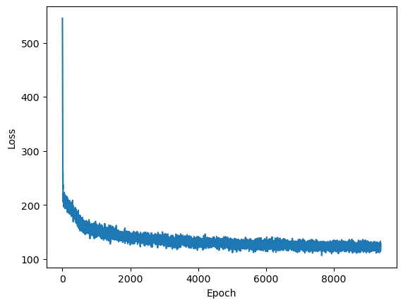
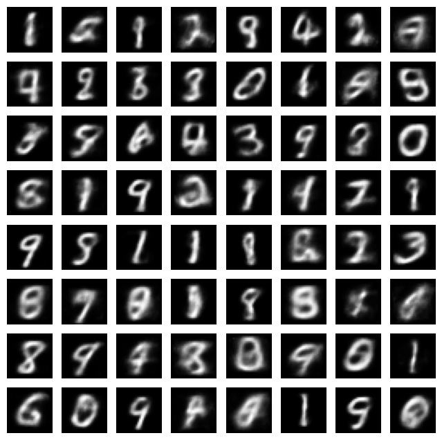

# GumbelSoftmax

[](https://github.com/arnauqb/GumbelSoftmax.jl/actions/workflows/CI.yml?query=branch%3Amain)
[](https://codecov.io/gh/arnauqb/GumbelSoftmax.jl)

This package implements:
1. [Gumbel-Softmax](https://arxiv.org/abs/1611.01144)
2. [Rao-Blackwellized Gumbel-Softmax](https://arxiv.org/abs/2010.04838)

in the Julia programming language. The package supports both forward-mode automatic differentiation (AD) and reverse-mode AD through 
[Zygote](https://github.com/FluxML/Zygote.jl) and [ForwardDiff](https://github.com/JuliaDiff/ForwardDiff.jl) respectively.

# 1. Installation

The easiest way is to get the package directly from the Julia repository

```julia
using Pkg
Pkg.add("GumbelSoftmax")
```

# 2. Usage

The expected input shape is `(latent_dimension, categorical_dimension, batch_dimension)`. As an example, let's suppose we have 4 Categorical distributions with 3 classes and we want to sample 10 times. In this case, `latent_dimension=4`, `categorical_dimension=3`, and `batch_dimension=10`.

```julia
using GumbelSoftmax, Random
logits = randn(4, 3, 10)
samples = sample_gumbel_softmax(logits=logits, tau=0.1, hard=true)
# or with Rao-Blackwellization
k = 10 # number of Monte-Carlo samples
samples = sample_rao_gumbel_softmax(logits=logits, tau=0.1, k=k)
```

# 3. Example: Discrete Variational Autoencoder (VAE)

We include an example of using the Gumbel-Softmax trick to implement a discrete VAE.
The example can be found in `examples/vae.jl` and it can be run with

```bash
julia examples/vae.jl
```
Here are some results:

VAE loss:



VAE reconstructions and generated samples:

<p float="left">
  
   
</p>
